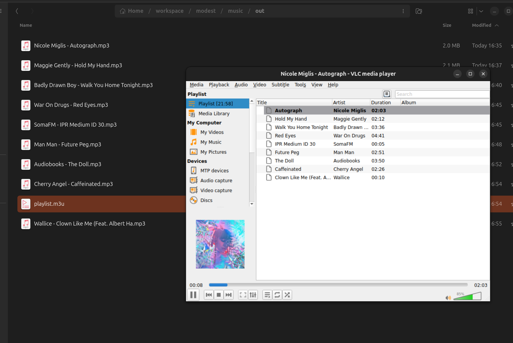

# rippy - a Perl-based audio stream ripper

## What is this?
A command line utility for saving individual audio files from an audio stream URL

## Usage
```
./rippy [stream URL] ([output directory])
```
The current track title is printed to stdout (terminal). It will create the optional [output directory] if needed.
Each track will be saved in the output directory with a file name based on the track title (track title may be sanitized).
An M3U playlist is created in the output directory.

Currently it supports only ICY protocol and MP3 formats.

## Why?
To archive the sessions of my internet DJ friends, and local radio shows that are otherwise not available as podcast/download 

## TODO
* Further sanitize filenames
* Support other streaming protocols
* Support audio file formats (AAC, FLAC, ...)
* Get album art, somehow
* Fetch more tags from external databases (Discogs, CDDB, ...)
* Send output to a Discord channel
* Offer to WUGA and/or WUOG for provisioning website download or podcast service
 - Copyright issues




